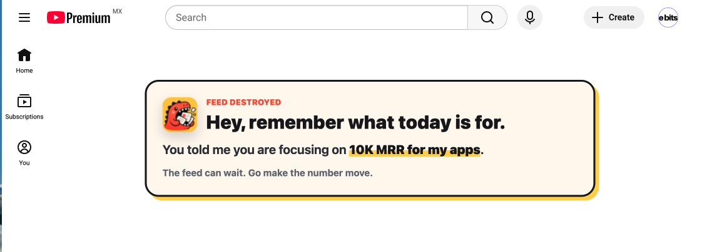

# Feed Destroyer

A tiny always-on Chrome extension that hides distracting surfaces on YouTube and X.




## What it does

- YouTube: hides home/browse feeds, recommendations, Shorts navigation entry points, comments, live chat, end-screen cards, mixes, and merch/fundraiser-style panels while keeping direct video and Shorts watching, search, subscriptions, and channel Shorts tabs usable.
- X: hides the Home timeline contents when `For you` is active by default. `Following` remains usable.
- Popup: lets you show or hide X's `For you` feed and set the local focus reminder shown where a blocked feed used to be.

### YouTube behavior

| Hidden | Preserved |
| --- | --- |
| Home and browse feeds | Direct video playback |
| Native watch-page recommendations | Gemini **Ask about this video** |
| Shorts sidebar and mini-guide entry points | Viewstats Pro |
| Comments and live chat | Search and subscriptions |
| Mixes, end-screen cards, and related distraction panels | Channel pages and channel Shorts tabs |
| Merch, donation, and fundraiser panels | Direct Shorts playback |

## Setup

```bash
npm install
npx playwright install chromium
npm run build
```

## Load in Chrome

1. Open `chrome://extensions`.
2. Enable Developer mode.
3. Click **Load unpacked**.
4. Select this project folder.

Run `npm run build` again after changing TypeScript or CSS, then reload the extension from `chrome://extensions`.

## Use

Click the Feed Destroyer toolbar icon to set what you are focusing on today.

Use **Hide X "For you" feed** to change X at any time. Switching it off restores
the feed immediately; switching it on hides the feed and restores the focus card.
The same switch appears inside X's focus card for quickly restoring the feed. When
the feed is visible, the reminder collapses into a slim switch bar so the control
never disappears. The setting is saved locally in Chrome.

Example:

```text
10K MRR for my apps
```

The extension stores this text locally in Chrome. When it destroys a feed, it replaces the feed area with a reminder card using your focus target.

To update the reminder, open the toolbar popup, edit the input, and refresh YouTube or X if the page does not update immediately.

## Checks

```bash
npm run check
```

This runs:

1. TypeScript validation.
2. Fast CSS policy checks.
3. A clean extension build in `dist/`.
4. Headless Playwright tests against the built unpacked extension.

The Playwright suite loads Feed Destroyer into bundled Chromium using the production
manifest. It intercepts `youtube.com` and `x.com` with deterministic HTML fixtures,
so it verifies the extension's real content scripts and CSS without depending on
live-site experiments, authentication, recommendations, or network stability.

Current browser coverage includes:

- YouTube home feed replacement.
- Watch recommendations hidden while Gemini and Viewstats remain visible.
- Direct Shorts and channel Shorts preserved while Shorts navigation stays hidden.
- Search, subscriptions, and channel pages preserved.
- X `For you` hidden by default, switchable from the focus card or popup, and `Following` preserved.

Run one behavior while developing:

```bash
npm run test:e2e -- -g "watch recommendations"
```

When adding or editing a feature, update its fixture and user-visible assertion first,
run the focused test, then run `npm run check`. Pull requests run the same suite in
GitHub Actions. Failed browser tests upload screenshots and Playwright traces as a
`playwright-diagnostics` artifact.

These fixture tests protect the intended behavior deterministically. YouTube and X can
still change their production DOM, so selector changes should also get a quick manual
smoke test against the live site before release.
